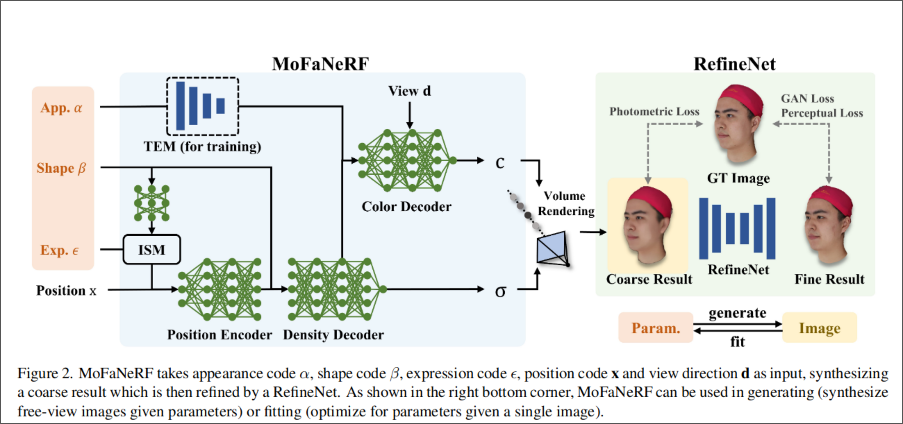
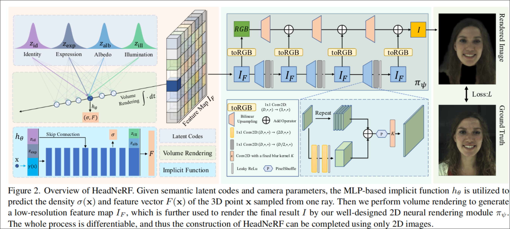
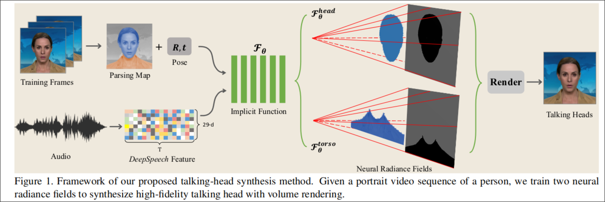
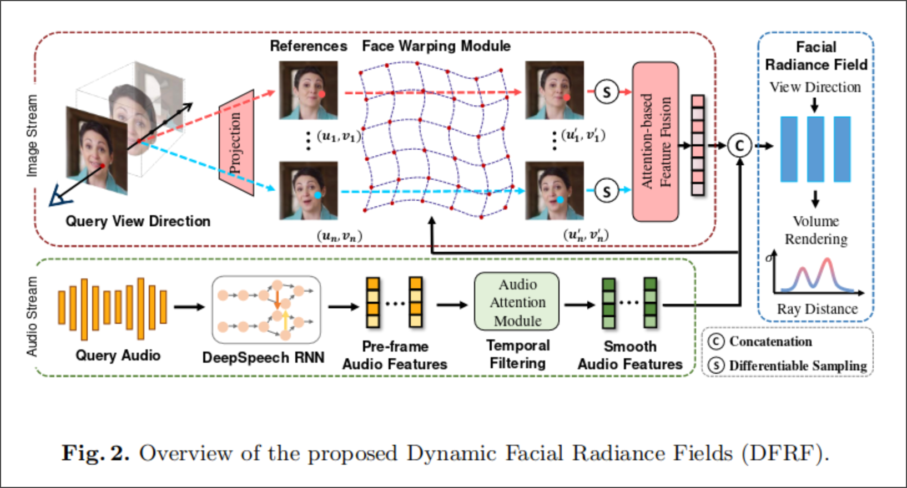

# ours

## more reasonable evaluation index
## loss function

# 基于NeRF的人脸重建

## MoFaNeRF

- 基于 facescape

### loss
- 光线颜色损失
- refinenet损失：pix2pixHD ganloss,感知损失

## HeadNeRF 
### loss 
- 像素级损失
- 感知损失(vgg16网络的第i层输出)
- 分离损失(3dmm编码保持相似)

# 基于NeRF的talking head

## AD-NeRF
- 头部、衣服分别建立NeRF
- 背景叠加
### loss：
- 像素级
- deepspeech损失

## DFRF

### 损失：
- 像素级
- 正则化

## DFA-NeRF

# 基于其他方法的talking head
