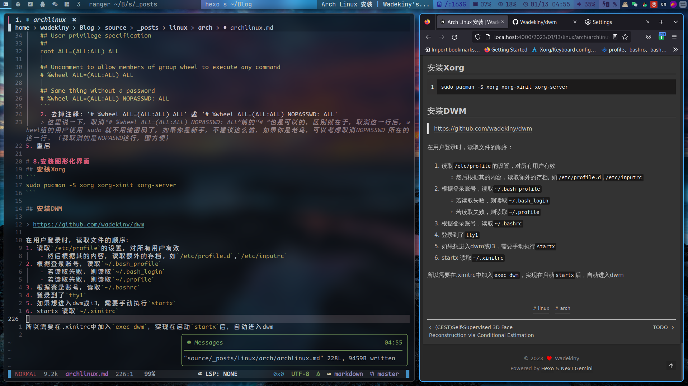

> Reference
> https://zhuanlan.zhihu.com/p/513859236
> https://zhuanlan.zhihu.com/p/138951848?ivk_sa=1025883i
# 1.下载 ISO，制作启动盘，分出空闲空间

1. > https://archlinux.org/download/

2. 制作工具使用 [Rufus](https://rufus.ie/en/)，写入方式为ISO(如果是DD的话，U盘就不能存其他文件了)，选项选择GPT而非默认的MBR
3. 分出空闲空间

# 2.BIOS 设置

- thinkbook14+ 在开机时按F1进入BIOS设置

1. 禁用safeboot 

2. 如果你的硬盘是NVMe的，把 从硬盘的启动方式 改成 AHCI

3. 修改启动顺序，把U盘的启动顺序放到最上面（此处小心，不要delete任何东西）

4. 完成之后退出重启

# 3.连接网络

1. 进入安装流程后，检查网络：`ip a`
2. 连接网络的3种方式
    - 有线连接
    `不会`
    - 无线连接
    ```shell
    iwctl #进入iwd模式
    device list #查看网卡名字，如果没有驱动就不能用
    station wlan0 scan #检查扫描网络，输入
    station wlan0 get-networks #查看网络名字，假设名字叫BUPT-portal，输入下面一行
    station wlan0 connect BUPT-portal #接着输入密码（如果有密码的话）
    exit    #退出
    ```
    - USB共享网络
        - 插上USB，手机上点击共享
        - 记得在之后挂载系统后安装usb驱动，`pacman -S usbmuxd`

3. 同步时间 `timedatectl set-ntp true`

# 4.硬盘分区
1. 检查硬盘,执行`lsblk`(之前划分好的空间不会显示)
2. 因为之前划好的空间在"nvme0n1"上，所以执行`cfdisk /dev/nvme0n1`，进入一个交互界面
3. 在之前分出的空间上建立两个分区，一个500M,后续用来挂载 "/boot/efi",剩下的挂载到"/"下 ( 懒得分home,swap了 ,swap和休眠功能有关), 最后要输入yes确认
4. 分区格式化
    ```shell
    mkfs.fat -F32 /dev/nvme0n1p2    (boot分区必须使用fat32格式,分区号根据实际情况修改)
    mkfs.ext4 /dev/nvme0n1p1    (/ 和 /home 一般使用ext4分区格式)
    ```
5. 分区挂载

    ```
    mount /dev/nvme0n1p1 /mnt    (将 / 分区挂载到 live系统中的 /mnt 目录，此时 /mnt 目录就是我们所安装系统的 / 目录)
    mkdir -p /mnt/boot/efi    (在新系统的 / 目录中新建 efi 文件夹，-p 参数表示递归创建)
    mount /dev/nvme0n1p2 /mnt/boot/efi    (将 boot 分区挂载到efi文件夹)
    ```

6. 检查，执行`lsblk`检查分区情况

# 5.安装系统
1. 换源，两种方法
    - `reflector --country China --age 72 --sort rate --protocol https --save /etc/pacman.d/mirrorlist`
    - 替换/etc/pacman.d/mirrorlist为以下任选其一
        ```
        Server = https://mirrors.bfsu.edu.cn/archlinux/$repo/os/$arch
        Server = https://mirrors.cqu.edu.cn/archlinux/$repo/os/$arch
        Server = https://mirrors.dgut.edu.cn/archlinux/$repo/os/$arch
        Server = https://mirrors.neusoft.edu.cn/archlinux/$repo/os/$arch
        Server = https://mirrors.nju.edu.cn/archlinux/$repo/os/$arch
        Server = https://mirror.redrock.team/archlinux/$repo/os/$arch
        Server = https://mirrors.sjtug.sjtu.edu.cn/archlinux/$repo/os/$arch
        Server = https://mirrors.tuna.tsinghua.edu.cn/archlinux/$repo/os/$arch
        Server = https://mirrors.ustc.edu.cn/archlinux/$repo/os/$arch
        Server = https://mirrors.xjtu.edu.cn/archlinux/$repo/os/$arch
        ```
2. 安装内核，三种可选

> 这里需要提前说一下，linux-zen 内核不支持 nvidia 显卡，有这个需求的就别装了，如果是原版 linux 内核的话，就要做好随时滚挂的准备，最近的 5.18 内核更新就会导致 nvidia-5.15 版本驱动失效无法开机（需要在启动选项中添加ibt=off），如果你希望稳定使用，就选择 linux-lts 内核和linux-lts-headers，并安装相应的 nvidia-lts 驱动（后面会有详细说明），不过不用太担心，即便是系统安装完成，你也可以随时切换自己想要的内核版本。
- 普通内核(linux linux-headers)
- **lts稳定版内核(linux-lts linux-lts-headers)**
- zen内核(linux-zen,linux-zen-headers)（高性能）


```
pacstrap /mnt base linux linux-headers linux-firmware base-devel （usbmuxd）
#或者
pacstrap /mnt base linux-lts linux-lts-headers linux-firmware base-devel （usbmuxd）
```

3. 写入分区表并检查
```
genfstab -U /mnt >> /mnt/etc/fstab
cat /mnt/etc/fstab
```

4. 进入新系统，`arch-chroot /mnt`

# 6.设置新系统

1. 要不要换源？按理说之前换的是安装系统的源而不是新系统的
2. 安装软件
    ```
    pacman -S neovim iwd ttf-dejavu sudo bluez usbmuxd networkmanager dhcpcd wqy-zenhei ntfs-3g
    ```
3. 设置时区时间
    ```
    ln -sf /usr/share/zoneinfo/Asia/Shanghai /etc/localtime    (设置时区为上海)
    hwclock --systohc
    ```

4. 设置语言
    1. 输入`nvim /etc/locale.gen`，删除【en\_US.UTF-8】和【zh\_CN.UTF-8】两项前面的“#”，保存。（如果有其他语言需求也可以自行取消注释，比如台湾地区和港澳地区）

    2. 输入`locale-gen`

    3. 输入`echo LANG=en_US.UTF-8 >> /etc/locale.conf`

5. 输入`passwd`设置root用户密码
6. 设置主机名`echo thinkbook14p >> /etc/hostname`
7. 设置网络
    ```
    127.0.0.1 localhost
    ::1 localhost
    127.0.1.1 thinkbook14p.localdomain thinkbook14p
    ```

8. 安装引导，重启系统
    1. 安装引导
    ```
    pacman -S grub efibootmgr   (安装grub)
    grub-install /dev/nvme0n1    (超级大坑，注意选择的是整个硬盘，而不是boot分区)
    grub-mkconfig -o /boot/grub/grub.cfg (创建grub配置文件)
    ```
    2. 重启系统(确保已经安装usbmuxd,可以用`pacman -Q`查看已安装的包
    ```
    exit    (退出新系统，回到live系统)
    umount -R /mnt    (递归卸载 /mnt 中的磁盘)
    reboot    (重启)
    ```
# 7.进入新系统
1. 激活服务,因为没有网卡驱动，后面装好后再连接，先用usb共享网络
```
systemctl start iwd.service
systemctl enable iwd.service
systemctl start systemd-resolved.service
systemctl enable systemd-resolved.service
systemctl enable bluetooth.service
systemctl enable NetworkManager
systemctl enable dhcpcd
```
2. 安装硬件驱动
    1. CPU编码
    ```
    pacman -S intel-ucode    (intel的cpu装这个)
    pacman -S amd-ucode    (amd的cpu装这个)
    ```
    2. 显卡驱动
    >这里举两个例子，我的笔记本，i7-11代，搭配intel核显以及3050显卡，所以安装前两个。我的台式机，e3-1230垃圾CPU，搭配HD6950显卡，所以装第三个。nvidia-dkms 与 nvidia-lts 不兼容，如果装lts驱动的话无需安装dkms 。注意：nvidia驱动的安装与前面选择的内核有关，如果你安装的是linux-lts内核，那么需要将nvidia更换为nvidia-lts，linux-zen不支持nvidia显卡（务必对号入座），如果你选择安装新内核，则需要修改一下ibt=off ，否则无法进入系统

    ```
    pacman -S xf86-video-intel（Intel集成显卡驱动，用Intel核显就装，否则不用装）
    pacman -S xf86-video-amdgpu (AMD集成显卡驱动，用amd显卡的就装)
    pacman -S mesa nvidia(-lts) nvidia-settings nvidia-dkms nvidia-utils nvidia-prime（nvidia显卡驱动，用nvidia显卡就装，否则不用装）
    ```
    3. 声卡驱动(忘了怎么装得了)
    ```
    pacman -S alsa-utils pulseaudio pulseaudio-alsa pulseaudio-bluetooth
    ```
    >输入“vim /etc/modprobe.d/disable_dmic.conf”，把下面的文字打进去，保存: 
    >`options snd_hda_intel dmic_detect=0` 

3. 创建用户
```
useradd -m -G wheel -s /bin/bash wadekiny    (添加一个名为wadekiny的用户进入wheel用户组，并将bash作为启动命令)
passwd wadekiny    (设置密码，和设置root是类似的)
```
4. 增加sudo权限`nvim /etc/sudoers`
    1. 找到：
    ```
    ## User privilege specification
    ##
    root ALL=(ALL:ALL) ALL

    ## Uncomment to allow members of group wheel to execute any command
    # %wheel ALL=(ALL:ALL) ALL

    ## Same thing without a password
    # %wheel ALL=(ALL:ALL) NOPASSWD: ALL
    ```
    2. 去掉注释: '# %wheel ALL=(ALL:ALL) ALL' 或 '# %wheel ALL=(ALL:ALL) NOPASSWD: ALL'
    > 这里说一下，取消“# %wheel ALL=(ALL:ALL) NOPASSWD: ALL”前的“# ”也是可以的，区别就在于，取消这一行后，wheel组的用户使用 sudo 就不用输密码了，如果你是新手，不建议这么做，如果你是老鸟，可以考虑取消NOPASSWD 所在的这一行。（我取消的是NOPASWD这行，图方便）
5. 重启

# 8.安装图形化界面
## 安装Xorg
```
sudo pacman -S xorg xorg-xinit xorg-server
```

## 安装DWM

> https://github.com/wadekiny/dwm

在用户登录时，读取文件的顺序：
1. 读取`/etc/profile`的设置，对所有用户有效
    - 然后根据其的内容，读取额外的存档, 如`/etc/profile.d`,`/etc/inputrc`
2. 根据登录账号，读取`~/.bash_profile`
    - 若读取失败，则读取`~/.bash_login`
    - 若读取失败，则读取`~/.profile`
3. 根据登录账号，读取`~/.bashrc`
4. 登录到了`tty1`
5. 如果想进入dwm或i3，需要手动执行`startx`
6. startx 读取`~/.xinitrc`

所以需要在.xinitrc中加入`exec dwm`，实现在启动`startx`后，自动进入dwm

